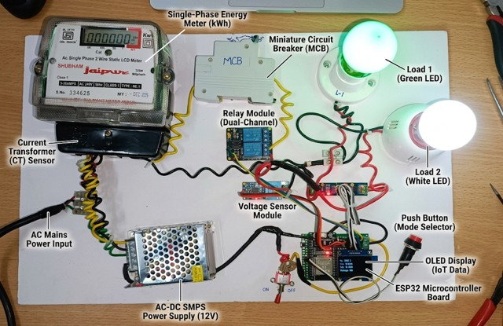
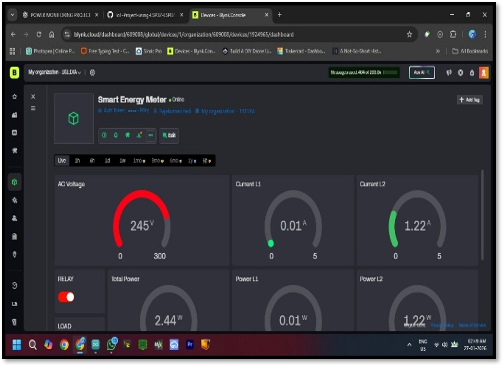

# Smart-Energy-Monitoring-system
# ⚡ Smart Energy Monitoring System

  
  

An IoT-based energy monitoring system using ESP32, Blynk Cloud, and real-time power measurement.

---

## 📖 Overview

This project presents an IoT-based Smart Energy Monitoring System that measures voltage, current, power, and energy consumption in real time. The system uses an ESP32 microcontroller with voltage and current sensors to monitor electrical parameters, display them on an OLED screen, and upload the data to the Blynk Cloud for remote monitoring through a mobile application.

---

## 🎯 Objectives

- Real-time power monitoring
- Accurate energy measurement
- Remote mobile visualization
- Efficient energy management

---

## ✨ Key Features

- Real-Time Voltage Monitoring
- Current Measurement
- Power & Energy Monitoring
- OLED Live Display
- Wi-Fi Connectivity
- Blynk Cloud Integration
- Mobile Dashboard
- Remote Load Control

---

## 💻 Technologies Used

| Category | Technology |
|----------|------------|
| Microcontroller | ESP32 |
| Programming | Embedded C/C++ |
| IDE | Arduino IDE |
| IoT Platform | Blynk Cloud |
| Mobile App | Blynk Mobile |
| Communication | Wi-Fi |
| Sensors | ACS712, ZMPT101B |
| Display | 1.3" OLED |
| Relay | Solid State Relay (SSR) |
