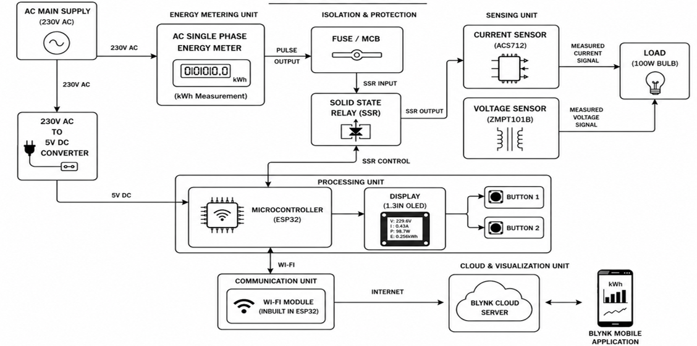

#  Smart Energy Monitoring System

  
  

An IoT-based energy monitoring system using ESP32, Blynk Cloud, and real-time power measurement.

---

##  Overview

This project presents an IoT-based Smart Energy Monitoring System that measures voltage, current, power, and energy consumption in real time. The system uses an ESP32 microcontroller with voltage and current sensors to monitor electrical parameters, display them on an OLED screen, and upload the data to the Blynk Cloud for remote monitoring through a mobile application.

---

##  Objectives

- Real-time power monitoring
- Accurate energy measurement
- Remote mobile visualization
- Efficient energy management

---

##  Key Features

- Real-Time Voltage Monitoring
- Current Measurement
- Power & Energy Monitoring
- OLED Live Display
- Wi-Fi Connectivity
- Blynk Cloud Integration
- Mobile Dashboard
- Remote Load Control

---

##  Technologies Used

| Category | Technology |
|----------|------------|
| Microcontroller | ESP32 |
| Programming | Embedded C/C++ |
| IDE | Arduino IDE |
| IoT Platform | Blynk Cloud |
| Mobile App | Blynk Mobile |
| Communication | Wi-Fi |
| Sensors | ACS712, ZMPT101B |
| Display | 1.3" OLED |
| Relay | Solid State Relay (SSR) |

---

##  System Architecture

  

The system uses an ESP32 microcontroller to acquire voltage and current data from sensors, process the measurements, display them on an OLED screen, and upload them to the Blynk Cloud through Wi-Fi for real-time monitoring and remote load control.

---

##  Working Principle

The Smart Energy Monitoring System uses an ESP32 microcontroller to read voltage and current values from sensors. The collected data is processed to calculate power and energy consumption, displayed on an OLED screen, and transmitted to the Blynk Cloud through Wi-Fi. Users can monitor electrical parameters in real time and remotely control connected loads using the Blynk mobile application.

---

##  Outcomes & Results

- Successfully monitored voltage, current, power, and energy consumption in real time.
- Displayed live electrical parameters on both the OLED display and Blynk mobile application.
- Enabled remote monitoring through Wi-Fi connectivity.
- Improved energy usage visibility for better power management.
- Demonstrated stable and reliable IoT-based energy monitoring.

---

##  Future Scope

- Integrate machine learning for energy consumption prediction.
- Store historical data for detailed energy analysis.
- Add fault detection and automatic alerts.
- Support smart home and smart grid applications.
- Improve system scalability for industrial energy monitoring.

---

##  Conclusion

This project demonstrates an IoT-based solution for real-time energy monitoring using ESP32 and Blynk Cloud. It provides accurate measurement of electrical parameters, remote visualization through a mobile application, and improved energy management, making it suitable for smart home and industrial monitoring applications.
